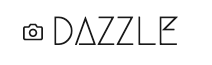
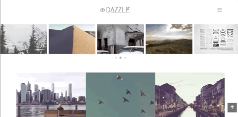

####  A photo gallery web application.

## User Story
* User can view all photos on index page ordered by the date they were posted
* Hovering on an image will reveal more information about it; the title, description, location and time posted.
* User can click on the copy button on an image to copy its url for sharing purposes
* Clicking an image will toggle a lightbox with an expanded view of the image
* User can navigate to other images while on the lightbox view.
* User can search photos based on their categories
* User can browse photos based on the location they were taken

## Author
[Collins Muriuki](https://github.com/collinsmuriuki), 26/10/2019.

## Description
A photo gallery web application made using Django.

## Technologies Used
* Python 3.7.4
* Django 1.11.23
* SQLite3
* HTML5  
* CSS3
* Javascript
* jQuery 3.4.1
* Bootstrap 4.3.1
* [Owl carousel 2.3.4](https://owlcarousel2.github.io/OwlCarousel2/)
* [Baguettebox.js 1.10.0](https://feimosi.github.io/baguetteBox.js/)
* Google Font API

## Requirements
* This program requires python3.+ (and pip) installed, a guide on how to install python on various platforms can be found [here](https://www.python.org/)
* Once python is installed, install the folowing external libraries provided in the requirements.txt file using pip
* Example: 
    * **`pip install django==1.11.23`**
* This project requires you to have a secret key from Uploadcare to facilitate cloud storage of uploaded images.
    * The secret key can be gotten by creating a free uploadcare account, starting a new project and navigating to the dashboard
    * The key should be stored as an enviremnetal variable in an .env file as hown below
        * **`SECRET=<your secret key here>`**
    * More info onhow to use the Django pyuploadcare library can be found [here](https://uploadcare.com/docs/guides/django/)

## Installation and Set-up
To view the app, open the live site link provided below on the README.
Here is a run through of how to set up the application:
* **Step 1** : Clone this repository using **`git clone https://github.com/collinsmuriuki/dazzle.git`**, or downloading a ZIP file of the code.
* **Step 2** : The repository, if downloaded as a .zip file will need to be extracted to your preferred location and opened
* **Step 3** : Go to the project root directory and install the virtualenv library using pip an afterwards create a virtual environment. Run the following commands respectively:
    * **`pip install virtualenv`**
    * **`virtualenv venv`**
    * **`source venv/bin/activate`**
        * Note that you can exit the virtual environment by running the command **`deactivate`**
* **Step 4** : Download the all dependencies in the requirements.txt using **`pip install -r requirements.txt`**
* **Step 5** : You can now launch the application locally by running the command **`python manage.py runserver`** and copying the link given on the termnal on your browser.
    * To post photos, run the command  **`python manage.py createsuperuser`** to create an admin account in order to post. Access to the admin panel is by adding the path /admin to the address bar.

## Known Bugs
* None at the momment, report any by contacting me

## Support and contact details
You can provide feedback or raise any issues/ bugs through the following means:
* murerwacollins@gmail.com

## Live Site link
You can view the live application by following this [link](https://dazzle100.herokuapp.com/).

## License
#### [*GNU License*](LICENSE)